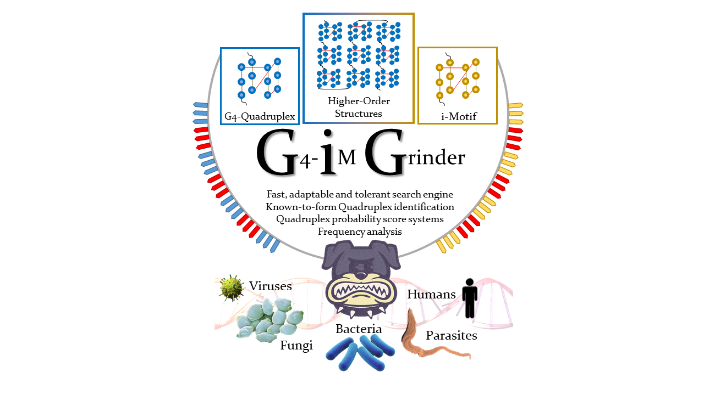
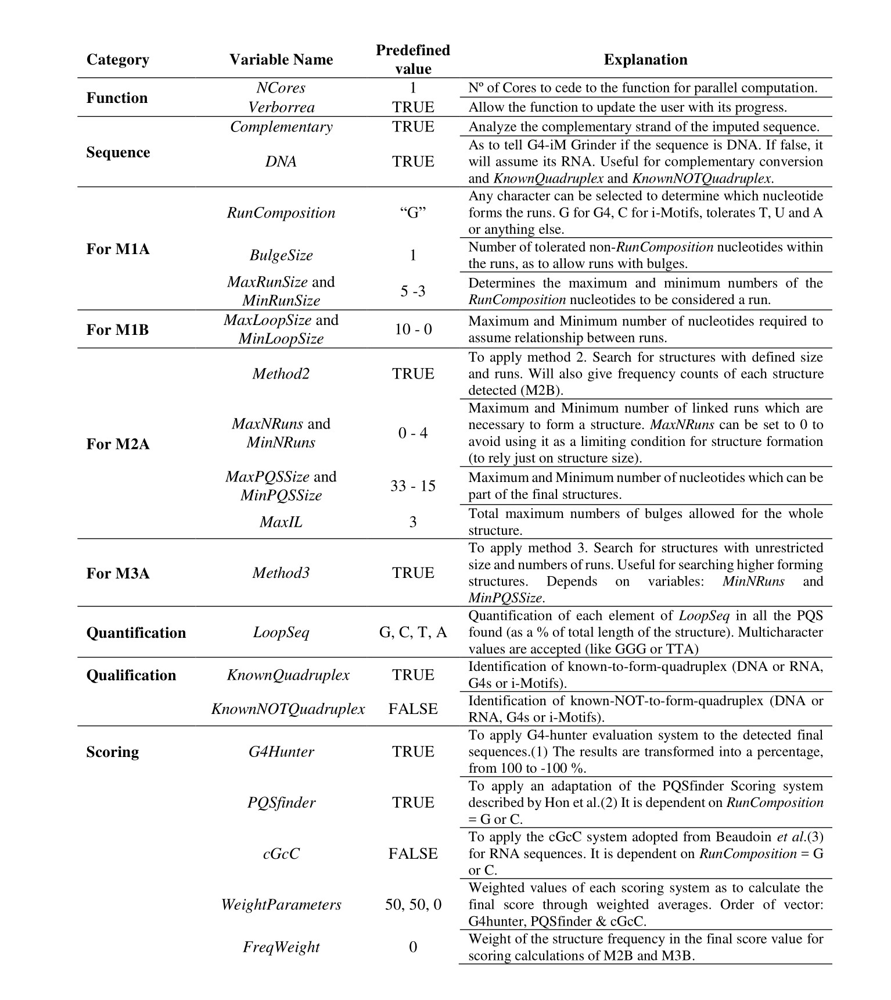

# G4-iM Grinder
G4-iM Grinder is a fast, robust and highly adaptable algorithm. It is capable of locating, identifying, qualifying and quantifying DNA and RNA potential quadruplex structures, such as G-quadruplex, i-Motifs and their higher order versions.

Read the open-access paper: [G4-iM Grinder: when size and frequency matter. G-Quadruplex, i-Motif and higher order structure search and analysis tool](https://academic.oup.com/nargab/article/2/1/lqz005/5576141)




Please report in the issue section if you find bugs, problems or wish to see some features added.


###       G4-iM Grinder's Results
The genomic results of humans and 49 other pathogenic species can be found through this [--link--](https://1drv.ms/u/s!AvVGQg2rNIwDgSLY11SVpU3ysfVG?e=2mba6N). Please report in the issue section if the link is broken.

The 1.5 Gb .RAR compressed file hosts four RData images of the results.

1. `hg39PQS.RData` for Human G-based PQS analysis
2. `hg39PiMS.RData` for Human C-based PiMS analysis
3. `NonHumanPQS.RData` for non-human G-based PQS analysis
4. `NonHumanPiMS.RData` for non-human C-based PiMS analysis.


###       Package prerequisites
G4-iM Grinder can be download from github: EfresBR/G4iMGrinder. G4-iM Grinder requires the installation of other CRAN based and Bioconductor packages. Please, ensure all required packages are installed and R version is at least 3.6.1. G4-iM Grinder was successfully downloaded and tested in MacOS 10.12.6, Windows 10 (x64), Ubuntu 18.04.2 (x64), Mint 19.1 (x64) and Fedora-workstation 30 whilst running R 3.6.1 and R studio 1.2.5001. In Linux based systems, the installation of devtools may require further effort ([Check this link](https://stackoverflow.com/questions/20923209/problems-installing-the-devtools-package)). Other OS including x86 systems have not been tested.
```ruby

pck <- c("stringr", "stringi", "plyr", "seqinr", "stats", "parallel", "doParallel", "beepr", "stats4", "devtools", "dplyr", "BiocManager")

#foo was written by Simon O'Hanlon Nov 8 2013.
#Thanks Simon, thanks StackOverflow and all its amazing community.

foo <- function(x){
  for( i in x ){
    #  require returns TRUE invisibly if it was able to load package
    if( ! require( i , character.only = TRUE ) ){
      #  If package was not able to be loaded then re-install
      install.packages( i , dependencies = TRUE )
      #  Load package after installing
      require( i , character.only = TRUE )
    }
  }
}
foo(pck)
BiocManager::install(c("BiocGenerics", "S4Vectors") , ask = FALSE, update = TRUE)


```

###      Package installing and loading
```ruby

devtools::install_github("EfresBR/G4iMGrinder")
library(G4iMGrinder)


```


###      Installation fails
The most common reasons for failing during the installation of G4-iM Grinder are ,

1. 	Some of G4-iM Grinder's dependencies have not been installed,
2. 	R version is not at least 3.6.0.

If you are having problems during installation, please, execute the following code to verify that these prerequisites are met.

```ruby


pck <- c("BiocGenerics", "S4Vectors", "stringr", "stringi", "plyr", "seqinr", "stats", "parallel", "doParallel", "beepr", "stats4", "devtools", "dplyr", "BiocManager")

FailFoo <- function(x){
  Info <- "Package dependendies FAILED. These packages are required and are NOT installed: "
  count <- 0
  for( i in x ){
    if( ! require( i , character.only = TRUE, quietly = TRUE ) ){
      Info <- paste0(Info, i, " ")
      count <- count +1
    }
  }
  ifelse(count ==0, yes = print("Package dependencies PASSED. All required packages are installed. "),
         no = print(Info))
  AAA <- R.version
  ifelse(as.numeric(AAA$major) == 3,
         yes= ifelse(as.numeric(AAA$minor >= 6),
                     yes = print("R version requirements PASSED. R version is at least 3.6 as required."),
                     no = print("R version requirements FAILED. R needs to be updated to version >= 3.6")),
         no = print("R version requirements FAILED. R needs to be updated to version >= 3.6"))
}
FailFoo(pck)


```

The result of this code should be:

```

[1] "Package dependencies PASSED. All required packages are installed. "
[1] "R version requirements PASSED. R version is at least 3.6 as required."

```

If both the package dependencies and R version have passed the test, and still the installation fails, please, write an issue in the issue section stating the transcript of the executed commands and the full error received.


###       Running a G4-iM Grinder analysis
Executing a genomic G-Quadruplex analysis with G4iMGrinder function

```ruby

# Using a genome available online
loc <- url("http://tritrypdb.org/common/downloads/release-36/Lmajor/fasta/TriTrypDB-36_Lmajor_ESTs.fasta")
Sequence <- paste0(seqinr::read.fasta(file = loc, as.string = TRUE, legacy.mode = TRUE, seqonly = TRUE, strip.desc = TRUE), collapse = "")

# Executing a grind on the sequence in search of PQS
Rs  <- G4iMGrinder(Name = "LmajorESTs", Sequence = Sequence)

# Forcing the folding rule to the limit (this will take longer)
Rs2 <- G4iMGrinder(Name = "LmajorESTs", Sequence = Sequence, BulgeSize = 2,   MaxIL = 10, MaxLoopSize = 20)


```
G4-iM Grinder allows huge flexibility to adapt to any of the users requirements.

###       G4-iM Grinder's variables and their predifined values

N.B. Several other parameters regarding PQSFinder are available for modification.


###       Summarizing G4-iM Grinder results
Summarizing an analysis with GiGList.Analysis function to compare the results between genomes. This will quantify the number of results and density of each analysis. It will also give the number of results that have at least a minimum frequency, score and size. These variables can be modified. See the package documentation for more information regarding GiGList.Analysis.

```ruby

# summarizing first search
ResultTable <- GiGList.Analysis(GiGList = Rs, iden = "Predefined")

# adding the second analysis in a new row
ResultTable[2,] <- GiGList.Analysis(GiGList = Rs2, iden= "ForceLimit")


```


###       Potential Higher Order Analysis  
Executing an analysis of a higher order structure with GiG.M3Structure to analyze its potential subunit configuration. This will give all and the most interesting subunit conformations as stated in the article. See the package documentation for more information regarding GiG.M3Structure.
```ruby

# analyzing the PHOQS structure in row 1 of data frame PQSM3A in Rs.
PHOQS126 <- GiG.M3Structure(GiGList = Rs, M3ACandidate = 1, MAXite = 10000)


```


###       Locating the references of Known-To-Form and Known-NOT-To-Form sequences
Finding the reference for the Known-To-Form Quadruplex structures of an interesting Result. This procedure is the same for Known-NOT-To-Form sequences.
```ruby

# The PHOQS structure in row 126 has the known-to-form sequence 93del.
RefPHOQS126 <- GiG.DB$GiG.DB.Refs[GiG.DB$GiG.DB.Refs$Name == "93del", ]


```


###       Updating results for a pre-existing analysis
Updating a G4-iM Grinder analysis with different variables using the GiGList.Updater function. This will avoid doing a new search analysis on the sequence and hence will be more time and resource efficient.

```ruby

# As the PHOQS structure in row 126 looks promising, we will also examine
# the Known-NOT-to-form Quadruplex of the results, quantify the % of GGG and TTA present in the sequence,
# and modify the score and frequency weight of the final score.
Rs3 <- GiGList.Updater(GiGList = Rs, KnownNOTQuadruplex = TRUE, KnownQuadruplex = TRUE,
                       LoopSeq = c("GGG", "TTA"), FreqWeight = 100, WeightParameters = c(75, 25, 0))


```


###       Grinding genomes in search of Potential i-Motif Sequences (PiMS)
To search for potential i-Motifs in the genome we can repeat the analysis with G4iMGrinder function changing RunComposition = “C”. However, if a previous analysis of the genome has already been done with the complementary base-pair, we can also use the function GiGList.Updater to search for the resulting opposite structures.

```ruby

# Doing a grind in search for i-Motifs in the sequence
Rs_iM1 <- G4iMGrinder(Name = "LmajorESTs", Sequence = Sequence, RunComposition = "C")

# Using the previous PQS search to locate the base-pair PiMS. This is more efficient.
# However as the sequences change, the previous analysis will be deleted.
# If you desire to vary the analysis with non-predefined values, they should be stated here.
Rs_iM2 <- GiGList.Updater(GiGList = Rs, ChangeRunComposition = TRUE)


```


###       G4-iM Grinder's quadruplex database
800 new known-to-form and known-not-form-Quadruplex and i-Motif sequences have been added to the database (V1.5.8).  
Structure of database has been modified, in preparation for the release of an app that allows adding sequences to the database by  the public  (shinny app).


###       Comments on G4-iM Grinder's Search Engine

G4-iM Grinder locates all overlapping and nested results that fit the user-defined (or predefined if none were inserted) parameters.
For example using predefined parameters, five possible PQS (in _italics_) results will be located for the genomic sequence

> **GGGG**TTAT**GGG**TTATT**GGTGG**TTATT**GGCG**TT**GGG**

1.	_**GGGG**TTAT**GGG**TTATT**GGTGG**TTATT**GGCG**_(~~TTGGG~~)
2.	_**GGGG**TTAT**GGG**TTATT**GGTGG**TTATT**GGCG**TT**GGG**_
3.	(~~G~~)_**GGG**TTAT**GGG**TTATT**GGTGG**TTATT**GGCG**_(~~TTGGG~~)  
4.	(~~G~~)_**GGG**TTAT**GGG**TTATT**GGTGG**TTATT**GGCG**TT**GGG**_
5.	(~~GGGGTTAT~~)_**GGG**TTATT**GGTGG**TTATT**GGCG**TT**GGG**_

The only current limitation of the search engine is when a perfect (for example, **GGG**) and an imperfect (for example, **GCGG**) run coexist within the same run (for example, **GCGGG**). Although it is possible that **GCGGG** forms a run, the perfect run (**GGG**) is favored to improve computing performance and the location of more likely to form sequences. For the Genomic Sequence

> **GCGGG**TTA**GGG**TTATTT**GGG**TTA**GGG**

using predefined parameters will result in the detection of:

-	(~~GC~~)_**GGG**TTA**GGG**TTATTT**GGG**TTA**GGG**_

whilst

-	_**GCGGG**TTA**GGG**TTATTT**GGG**TTA**GGG**_

will not be detected.

Regarding frequency of the quadruplex results, Quadruplexes may actually be repeated because they form part of repetitive nucleotide sequences, including transposon families. For example, several authors have already located recurrent PQS in such repetitive elements (both human and non-human species), which depending on the location and context, may potentially grant different biological significance to the same recurrent quadruplex.


