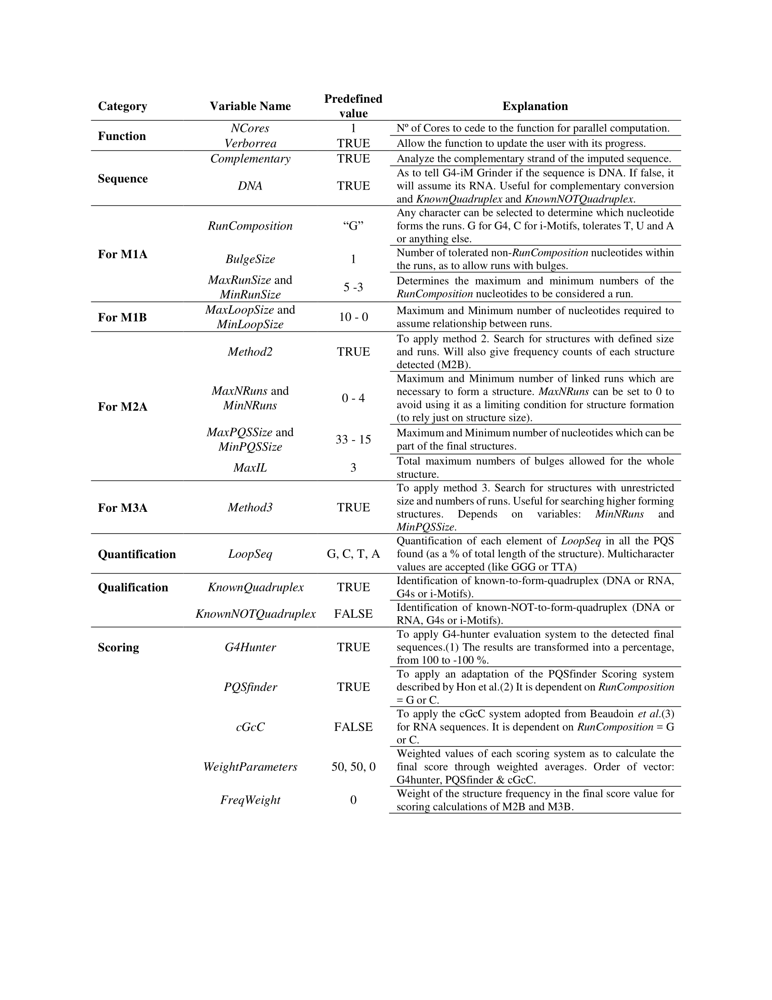

# G4-iM Grinder
G4-iM Grinder is a fast, robust and highly adaptable algorithm. It is capable of locating, identifying, qualifying and quantifying DNA and RNA potential quadruplex structures, such as G-quadruplex, i-Motifs and their higher order versions.


###       Prerequisites
G4-iM Grinder requires the installation of other CRAN based and Bioconductor packages. Please, make sure all required packages are installed. G4-iM Grinder was successfully downloaded and tested in MacOS 10.12.6, Windows 10 (x64) and Ubuntu 18.04.1 (x64) running R 3.6.0 (and older) and R studio 1.2.1135 (and older). In Ubuntu the installation of devtools may require further effort. Other OS including x86 systems have not been tested.

```

pck <- c("stringr", "stringi", "plyr", "seqinr", "stats", "parallel", "doParallel", "beepr", "stats4", "devtools", "dplyr", "BiocManager")

#foo was written by Simon O'Hanlon Nov 8 2013.
#Thanks Simon, thanks StackOverflow and all its amazing community.

foo <- function(x){
  for( i in x ){
    #  require returns TRUE invisibly if it was able to load package
    if( ! require( i , character.only = TRUE ) ){
      #  If package was not able to be loaded then re-install
      install.packages( i , dependencies = TRUE )
      #  Load package after installing
      require( i , character.only = TRUE )
    }
  }
}
foo(pck)
BiocManager::install(c("BiocGenerics", "S4Vectors") , ask = FALSE, update = TRUE)


```


###       Installing and loading
```

devtools::install_github("EfresBR/G4iMGrinder")
library(G4iMGrinder)


```


###       Running a G4-iM Grinder analysis
Executing a genomic G-Quadruplex analysis with G4iMGrinder function

```

# Using a genome available online
loc <- url("http://tritrypdb.org/common/downloads/release-36/Lmajor/fasta/TriTrypDB-36_Lmajor_ESTs.fasta")
Sequence <- paste0(seqinr::read.fasta(file = loc, as.string = TRUE, legacy.mode = TRUE, seqonly = TRUE, strip.desc = TRUE), collapse = "")

# Executing a grind on the sequence in search of PQS
Rs  <- G4iMGrinder(Name = "LmajorESTs", Sequence = Sequence)

# Forcing the folding rule to the limit (this will take longer)
Rs2 <- G4iMGrinder(Name = "LmajorESTs", Sequence = Sequence, BulgeSize = 2,   MaxIL = 10, MaxLoopSize = 20)


```
G4-iM Grinder allows huge flexibility to adapt to any of the users requirements.


###       Summarizing G4-iM Grinder results
Summarizing an analysis with GiGList.Analysis function to compare the results between genomes. This will quantify the number of results and density of each analysis. It will also give the number of results that have at least a minimum frequency, score and size. These variables can be modified. See the package documentation for more information regarding GiGList.Analysis.

```

# summarizing first search
ResultTable <- GiGList.Analysis(GiGList = Rs, iden = "Predefined")

# adding the second analysis in a new row
ResultTable[2,] <- GiGList.Analysis(GiGList = Rs2, iden= "ForceLimit")


```


###       Potential Higher Order Analysis  
Executing an analysis of a higher order structure with GiG.M3Structure to analyze its potential subunit configuration. This will give all and the most interesting subunit conformations as stated in the article. See the package documentation for more information regarding GiG.M3Structure.
```

# analyzing the PHOQS structure in row 1 of data frame PQSM3A in Rs.
PHOQS126 <- GiG.M3Structure(GiGList = Rs, M3ACandidate = 1, MAXite = 10000)


```


###       Locating the references of Known-To-Form and Known-NOT-To-Form sequences
Finding the reference for the Known-To-Form Quadruplex structures of an interesting Result. This procedure is the same for Known-NOT-To-Form sequences.
```

# The PHOQS structure in row 126 has the known-to-form sequence 93del.
RefPHOQS126 <- Known_to_form_Quadruplex[Known_to_form_Quadruplex$Name == "93del",c("Ref", "DOI")]

```


###       Updating results for a pre-existing analysis
Updating a G4-iM Grinder analysis with different variables using the GiGList.Updater function. This will avoid doing a new search analysis on the sequence and hence will be more time and resource efficient.

```

# As the PHOQS structure in row 126 looks promising, we will also examine
# the Known-NOT-to-form Quadruplex of the results, quantify the % of GGG and TTA present in the sequence,
# and modify the score and frequency weight of the final score.
Rs3 <- GiGList.Updater(GiGList = Rs, KnownNOTQuadruplex = TRUE, KnownQuadruplex = TRUE,
                       LoopSeq = c("GGG", "TTA"), FreqWeight = 100, WeightParameters = c(75, 25, 0))


```


###       Grinding genomes in search of Potential i-Motif Sequences (PiMS)
To search for potential i-Motifs in the genome we can repeat the analysis with G4iMGrinder function changing RunComposition = “C”. However, if a previous analysis of the genome has already been done with the complementary base-pair, we can also use the function GiGList.Updater to search for the resulting opposite structures.

```

# Doing a grind in search for i-Motifs in the sequence
Rs_iM1 <- G4iMGrinder(Name = "LmajorESTs", Sequence = Sequence, RunComposition = "C")

# Using the previous PQS search to locate the base-pair PiMS. This is more efficient.
# However as the sequences change, the previous analysis will be deleted.
# If you desire to vary the analysis with non-predefined values, they should be stated here.
Rs_iM2 <- GiGList.Updater(GiGList = Rs, ChangeRunComposition = TRUE)


```


###       G4-iM Grinder's variables and their predifined values

